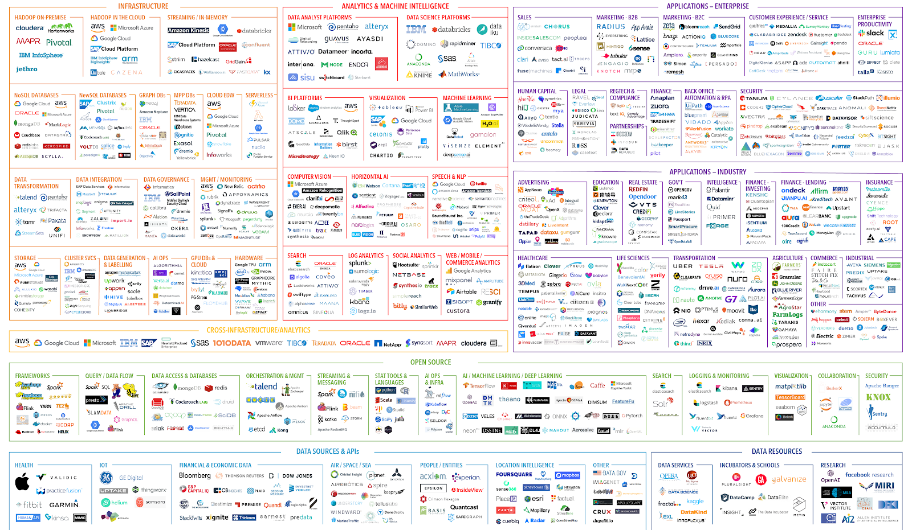

# What you get here?
Here you will get detailed concept explanation of tech stack like <b>Data Science</b>, <b>Data Analytics</b>, <b>Big Data</b>, <b>MLOps</b>. Default programming language will be <b>Python</b>. We will also be using other languages like <b>Bash</b>, <b>SQL</b>. You will also find the links of important research papers that you may require to get good hands on.

## Top view of AI tools

## Road Map for Data Scientist

## Road Map for Data Analyst

## Road Map for Data Engineering (Big Data)

## Table of Contents

- [Python](./docs/Python.md)
- [DBMS](./docs/DBMS.md)
- [SQL](./docs/SQL.md)
- [Machine Learning](./docs/ML.md)
- [Deep Learning](./docs/DL.md)
- [MLOps](./docs/MLOps.md)
- [Big Data](./docs/BigData.md)
- [Data Analytics](./docs/DataAnalytics.md)
- [Research Papers](./docs/ResearchPapers.md)
- [Feedback](./docs/Feedback.md)
