## Home

Database Management System or DBMS refers to the technology of sorting, filtering and retrieving the data with utmost efficiency along with appropriate safety measures. 

### Why Learn DBMS

Traditionally data was organized in file formats. DBMS was a new concept then, and all the research was done to make it overcome the deficiencies of the traditional standard of data management. A modern DBMS has the following characteristics:
    ```
    1. Real World Entity - A modern DBMS is more realistic and uses real-world entities to design it's architecture. 
       It uses the behavior and attributes too. For example, a school database may use students as an entity and 
       their age as an attribute.
    
    2. Relation Based Tables - DBMS allows entities and relations among them to form tables. A user can understand 
       the architecture of a database just by looking at the table name and attributes.
    
    3. Isolation of data and application - A database system is entirely different than its data. A database is an 
       active entity, whereas data is said to be passive, on which the database works and organizes. DBMS also 
       stores metadata, which is data about data, to ease its own process.
    
    4. Less Redundancy - DBMS follows the rules of normalization, which splits a relation when any of its attributes
       is having redundancy in values. Normalization is a mathematically rich and scientific process that reduces 
       data redundancy.
    
    5. Consistency - Consistency is a state where every relation in a database remains consistent. There exist 
       methods and techniques, which can detect attempt of leaving database in inconsistent state. A DBMS can provide 
       greater consistency as compared to earlier forms of data storing applications like file-processing systems.
    
    6. Query Language - DBMS is equipped with query language, which makes it more efficient to retrieve and 
       manipulate data. A user can apply as many and as different filtering options as required to retrieve a set 
       of data. Traditionally it was not possible where file-processing system was used.
    ```

### Applications of DBMS

Database is a collection of related data and data is a collection of facts and figures that can be processed to produce information.

Mostly data represents recordable facts. Data aids in producing information, which is based on facts. For example, if we have data about marks obtained by all students, we can then conclude about toppers and average marks.

A database management system stores data in such a way that it becomes easier to retrieve, manipulate, and produce information. Following are the important characteristics and applications of DBMS.

    
    1. ACID Properties − DBMS follows the concepts of Atomicity, Consistency, Isolation, and Durability (normally 
       shortened as ACID). These concepts are applied on transactions, which manipulate data in a database. ACID 
       properties help the database stay healthy in multi-transactional environments and in case of failure.

    2. Multiuser and Concurrent Access − DBMS supports multi-user environment and allows them to access and 
       manipulate data in parallel. Though there are restrictions on transactions when users attempt to handle 
       the same data item, but users are always unaware of them.

    3. Multiple views − DBMS offers multiple views for different users. A user who is in the Sales department will
       have a different view of database than a person working in the Production department. This feature enables 
       the users to have a concentrate view of the database according to their requirements.

    4. Security − Features like multiple views offer security to some extent where users are unable to access data 
       of other users and departments. DBMS offers methods to impose constraints while entering data into the 
       database and retrieving the same at a later stage. DBMS offers many different levels of security features, 
       which enables multiple users to have different views with different features. For example, a user in the 
       Sales department cannot see the data that belongs to the Purchase department. Additionally, it can also be 
       managed how much data of the Sales department should be displayed to the user. Since a DBMS is not saved on 
       the disk as traditional file systems, it is very hard for miscreants to break the code.
    
## Overview

Database is a collection of related data and data is a collection of facts and figures that can be processed to produce information.

Mostly data represents recordable facts. Data aids in producing information, which is based on facts. For example, if we have data about marks obtained by all students, we can then conclude about toppers and average marks.

A database management system stores data in such a way that it becomes easier to retrieve, manipulate, and produce information.

### Characteristics

Traditionally, data was organized in file formats. DBMS was a new concept then, and all the research was done to make it overcome the deficiencies in traditional style of data management. A modern DBMS has the following characteristics.

    1. Real World Entity - A modern DBMS is more realistic and uses real-world entities to design it's architecture. 
       It uses the behavior and attributes too. For example, a school database may use students as an entity and 
       their age as an attribute.
    
    2. Relation Based Tables - DBMS allows entities and relations among them to form tables. A user can understand 
       the architecture of a database just by looking at the table name and attributes.
    
    3. Isolation of data and application - A database system is entirely different than its data. A database is an 
       active entity, whereas data is said to be passive, on which the database works and organizes. DBMS also 
       stores metadata, which is data about data, to ease its own process.
    
    4. Less Redundancy - DBMS follows the rules of normalization, which splits a relation when any of its attributes
       is having redundancy in values. Normalization is a mathematically rich and scientific process that reduces 
       data redundancy.
    
    5. Consistency - Consistency is a state where every relation in a database remains consistent. There exist 
       methods and techniques, which can detect attempt of leaving database in inconsistent state. A DBMS can provide 
       greater consistency as compared to earlier forms of data storing applications like file-processing systems.
    
    6. Query Language - DBMS is equipped with query language, which makes it more efficient to retrieve and 
       manipulate data. A user can apply as many and as different filtering options as required to retrieve a set 
       of data. Traditionally it was not possible where file-processing system was used.

    7. ACID Properties − DBMS follows the concepts of Atomicity, Consistency, Isolation, and Durability (normally 
       shortened as ACID). These concepts are applied on transactions, which manipulate data in a database. ACID 
       properties help the database stay healthy in multi-transactional environments and in case of failure.

    8. Multiuser and Concurrent Access − DBMS supports multi-user environment and allows them to access and 
       manipulate data in parallel. Though there are restrictions on transactions when users attempt to handle 
       the same data item, but users are always unaware of them.

    9. Multiple views − DBMS offers multiple views for different users. A user who is in the Sales department will
       have a different view of database than a person working in the Production department. This feature enables 
       the users to have a concentrate view of the database according to their requirements.

    10. Security − Features like multiple views offer security to some extent where users are unable to access data 
       of other users and departments. DBMS offers methods to impose constraints while entering data into the 
       database and retrieving the same at a later stage. DBMS offers many different levels of security features, 
       which enables multiple users to have different views with different features. For example, a user in the 
       Sales department cannot see the data that belongs to the Purchase department. Additionally, it can also be 
       managed how much data of the Sales department should be displayed to the user. Since a DBMS is not saved on 
       the disk as traditional file systems, it is very hard for miscreants to break the code.

### Users

A regular DBMS has users with varying rights and permissions for different purposes. Some users retrieve data, while others perform data backups. The users of a DBMS can generally be classified as follows:
   ```
   1. Administrators - Administrators maintain the DBMS and have the responsibility of managing the database. They 
      oversee its usage and determine who can access it. They create user profiles and enforce restrictions to ensure 
      security and isolation. Administrators also handle DBMS resources like system licenses, necessary tools, and 
      maintenance of software and hardware.

   2. Designers are the individuals who focus on the design aspects of the database. They carefully consider what 
      data needs to be stored and in what format. They identify and design the complete set of entities, relationships, 
      constraints, and views.

   3. End users are the ones who directly benefit from having a DBMS. They can range from casual observers who review 
      logs or market rates to sophisticated users like business analysts.
   ```

## Architecture

The way a DBMS is designed depends on its architecture. It can be centralized, decentralized, or hierarchical. The architecture of a DBMS can be classified as either single-tier or multi-tier. In a multi-tier architecture, the entire system is divided into n modules that are related but independent. These modules can be modified, altered, changed, or replaced independently.

### 1-tier architecture
In 1-Tier Architecture the database is directly available to the user, the user can directly sit on the DBMS and use it that is, the client, server, and Database are all present on the same machine. For Example: to learn SQL we set up an SQL server and the database on the local system. This enables us to directly interact with the relational database and execute operations. The industry won’t use this architecture they logically go for 2-Tier and 3-Tier Architecture.

#### Advantages of 1-tier architecture
- Simple Architecture: 1-Tier Architecture is the most simple architecture to set up, as only a single machine is required to maintain it.
- Cost-Effective: No additional hardware is required for implementing 1-Tier Architecture, which makes it cost-effective.
- Easy to Implement: 1-Tier Architecture can be easily deployed, and hence it is mostly used in small projects. 

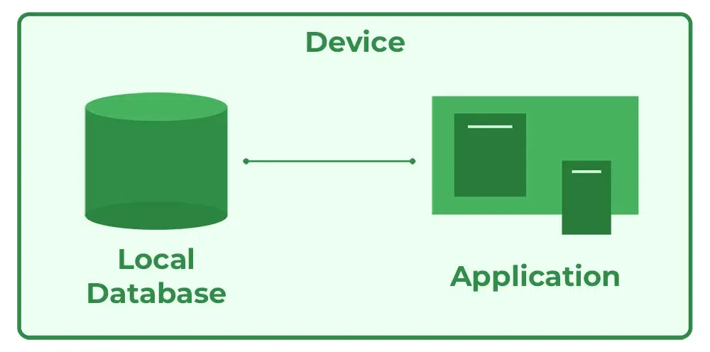

### 2-tier architecture
The 2-tier architecture is similar to a basic client-server model. The application at the client end directly communicates with the database on the server side. APIs like ODBC and JDBC are used for this interaction. The server side is responsible for providing query processing and transaction management functionalities. On the client side, the user interfaces and application programs are run. The application on the client side establishes a connection with the server side in order to communicate with the DBMS. 
An advantage of this type is that maintenance and understanding are easier, and compatible with existing systems. However, this model gives poor performance when there are a large number of users. 

#### Advantages of 2-tier architecture
- Easy to Access: 2-Tier Architecture makes easy access to the database, which makes fast retrieval.
- Scalable: We can scale the database easily, by adding clients or by upgrading hardware.
- Low Cost: 2-Tier Architecture is cheaper than 3-Tier Architecture and Multi-Tier Architecture.
- Easy Deployment: 2-Tier Architecture is easy to deploy than 3-Tier Architecture.
- Simple: 2-Tier Architecture is easily understandable as well as simple because of only two components.


### 3-tier architecture
In 3-Tier Architecture, there is another layer between the client and the server. The client does not directly communicate with the server. Instead, it interacts with an application server which further communicates with the database system and then the query processing and transaction management takes place. This intermediate layer acts as a medium for the exchange of partially processed data between the server and the client. This type of architecture is used in the case of large web applications. 

#### Advantages of 3-tier architecture
- Enhanced scalability: Scalability is enhanced due to distributed deployment of application servers. Now, individual connections need not be made between the client and server.
- Data Integrity: 3-Tier Architecture maintains Data Integrity. Since there is a middle layer between the client and the server, data corruption can be avoided/removed.
- Security: 3-Tier Architecture Improves Security. This type of model prevents direct interaction of the client with the server thereby reducing access to unauthorized data.

#### Disadvantages of 3-tier Architecture

- More Complex: 3-Tier Architecture is more complex in comparison to 2-Tier Architecture. Communication Points are also doubled in 3-Tier Architecture.
- Difficult to Interact: It becomes difficult for this sort of interaction to take place due to the presence of middle layers.


### Data Models
Data models define how the logical structure of a database is modeled. Data Models are fundamental entities to introduce abstraction in a DBMS. Data models define how data is connected to each other and how they are processed and stored inside the system.

The very first data model could be flat data-models, where all the data used are to be kept in the same plane. Earlier data models were not so scientific, hence they were prone to introduce lots of duplication and update anomalies.

#### Entity Relationship Model
Entity-Relationship (ER) Model is based on the notion of real-world entities and relationships among them. While formulating real-world scenario into the database model, the ER Model creates entity set, relationship set, general attributes and constraints.

ER Model is best used for the conceptual design of a database.

ER Model is based on:

- Entity − An entity in an ER Model is a real-world entity having properties called attributes. Every attribute is defined by its set of values called domain. For example, in a school database, a student is considered as an entity. Student has various attributes like name, age, class, etc.

- Relationship − The logical association among entities is called relationship. Relationships are mapped with entities in various ways. Mapping cardinalities define the number of association between two entities.

Mapping cardinalities:

   - one to one
   - one to many
   - many to one
   - many to many


#### Relational Model
The most popular data model in DBMS is the Relational Model. It is more scientific a model than others. This model is based on first-order predicate logic and defines a table as an n-ary relation. The main highlights of this model are:
- Data is stored in tables called relations.
- Relations can be normalized.
- In normalized relations, values saved are atomic values.
- Each row in a relation contains a unique value.
- Each column in a relation contains values from a same domain.

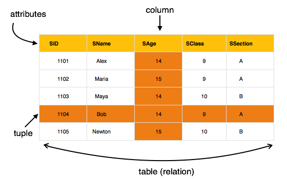

### Data Schemas
A database schema is the skeleton structure that represents the logical view of the entire database. It defines how the data is organized and how the relations among them are associated. It formulates all the constraints that are to be applied on the data.

A database schema defines its entities and the relationship among them. It contains a descriptive detail of the database, which can be depicted by means of schema diagrams. It’s the database designers who design the schema to help programmers understand the database and make it useful.


A database schema can be divided broadly into two categories:
- Physical Database Schema − This schema pertains to the actual storage of data and its form of storage like files, indices, etc. It defines how the data will be stored in a secondary storage.
- Logical Database Schema − This schema defines all the logical constraints that need to be applied on the data stored. It defines tables, views, and integrity constraints.

#### Database Instance
It is important that we distinguish these two terms individually. Database schema is the skeleton of database. It is designed when the database doesn't exist at all. Once the database is operational, it is very difficult to make any changes to it. A database schema does not contain any data or information.

A database instance is a state of operational database with data at any given time. It contains a snapshot of the database. Database instances tend to change with time. A DBMS ensures that its every instance (state) is in a valid state, by diligently following all the validations, constraints, and conditions that the database designers have imposed.

### Data Independence

A database system normally contains a lot of data in addition to users’ data. For example, it stores data about data, known as metadata, to locate and retrieve data easily. It is rather difficult to modify or update a set of metadata once it is stored in the database. But as a DBMS expands, it needs to change over time to satisfy the requirements of the users. If the entire data is dependent, it would become a tedious and highly complex job.

Metadata itself follows a layered architecture, so that when we change data at one layer, it does not affect the data at another level. This data is independent but mapped to each other.

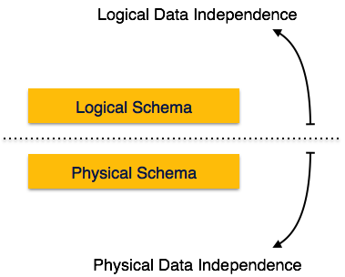

#### Logical Data Independence
Logical data is data about database, that is, it stores information about how data is managed inside. For example, a table (relation) stored in the database and all its constraints, applied on that relation.

Logical data independence is a kind of mechanism, which liberalizes itself from actual data stored on the disk. If we do some changes on table format, it should not change the data residing on the disk.

#### Physical Data Independence
All the schemas are logical, and the actual data is stored in bit format on the disk. Physical data independence is the power to change the physical data without impacting the schema or logical data.

For example, in case we want to change or upgrade the storage system itself − suppose we want to replace hard-disks with SSD − it should not have any impact on the logical data or schemas.

### Entity Relationship Model
The ER model defines the conceptual view of a database. It works around real-world entities and the associations among them. At view level, the ER model is considered a good option for designing databases.

#### Entity
An entity can be a real-world object, either animate or inanimate, that can be easily identifiable. For example, in a school database, students, teachers, classes, and courses offered can be considered as entities. All these entities have some attributes or properties that give them their identity.

An entity set is a collection of similar types of entities. An entity set may contain entities with attribute sharing similar values. For example, a Students set may contain all the students of a school; likewise a Teachers set may contain all the teachers of a school from all faculties. Entity sets need not be disjoint.

#### Attributes
Entities are represented by means of their properties, called attributes. All attributes have values. For example, a student entity may have name, class, and age as attributes.

There exists a domain or range of values that can be assigned to attributes. For example, a student's name cannot be a numeric value. It has to be alphabetic. A student's age cannot be negative, etc.

##### Types of Attributes
- Simple attribute − Simple attributes are atomic values, which cannot be divided further. For example, a student's phone number is an atomic value of 10 digits.

- Composite attribute − Composite attributes are made of more than one simple attribute. For example, a student's complete name may have first_name and last_name.

- Derived attribute − Derived attributes are the attributes that do not exist in the physical database, but their values are derived from other attributes present in the database. For example, average_salary in a department should not be saved directly in the database, instead it can be derived. For another example, age can be derived from data_of_birth.

- Single-value attribute − Single-value attributes contain single value. For example − Social_Security_Number.

- Multi-value attribute − Multi-value attributes may contain more than one values. For example, a person can have more than one phone number, email_address, etc.

##### Entity-Set and Keys
Key is an attribute or collection of attributes that uniquely identifies an entity among entity set.

For example, the roll_number of a student makes him/her identifiable among students.

- Super Key − A set of attributes (one or more) that collectively identifies an entity in an entity set.

- Candidate Key − A minimal super key is called a candidate key. An entity set may have more than one candidate key.

- Primary Key − A primary key is one of the candidate keys chosen by the database designer to uniquely identify the entity set.

### Relationship
The association among entities is called a relationship. For example, an employee works_at a department, a student enrolls in a course. Here, Works_at and Enrolls are called relationships.

#### Relationship Set
A set of relationships of similar type is called a relationship set. Like entities, a relationship too can have attributes. These attributes are called descriptive attributes.

#### Degree of Relationship
The number of participating entities in a relationship defines the degree of the relationship.

- Binary = degree 2
- Ternary = degree 3
- n-ary = degree

#### Mapping Cardinalities
Cardinality defines the number of entities in one entity set, which can be associated with the number of entities of other set via relationship set.

One-to-one − One entity from entity set A can be associated with at most one entity of entity set B and vice versa.

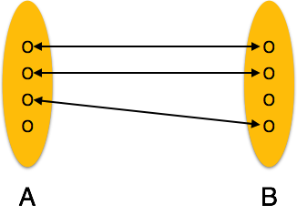

One-to-many − One entity from entity set A can be associated with more than one entities of entity set B however an entity from entity set B, can be associated with at most one entity.


Many-to-one − More than one entities from entity set A can be associated with at most one entity of entity set B, however an entity from entity set B can be associated with more than one entity from entity set A.

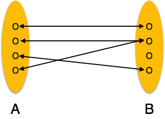

Many-to-many − One entity from A can be associated with more than one entity from B and vice versa.

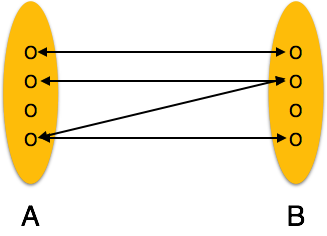

### ER Diagram Representation
Let us now learn how the ER Model is represented by means of an ER diagram. Any object, for example, entities, attributes of an entity, relationship sets, and attributes of relationship sets, can be represented with the help of an ER diagram.

#### Entity
Entities are represented by means of rectangles. Rectangles are named with the entity set they represent.


#### Attributes
Attributes are the properties of entities. Attributes are represented by means of ellipses. Every ellipse represents one attribute and is directly connected to its entity (rectangle).

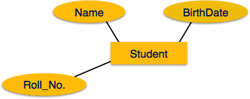

If the attributes are composite, they are further divided in a tree like structure. Every node is then connected to its attribute. That is, composite attributes are represented by ellipses that are connected with an ellipse.


Multivalued attributes are depicted by double ellipse.

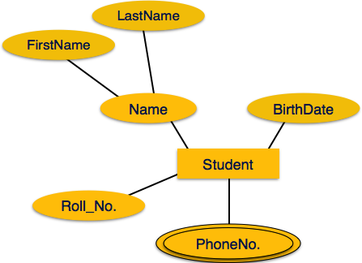

Derived attributes are depicted by dashed ellipse.


#### Relationship
Relationships are represented by diamond-shaped box. Name of the relationship is written inside the diamond-box. All the entities (rectangles) participating in a relationship, are connected to it by a line.

##### Binary Relationship and Cardinality
A relationship where two entities are participating is called a binary relationship. Cardinality is the number of instance of an entity from a relation that can be associated with the relation.

- One-to-one − When only one instance of an entity is associated with the relationship, it is marked as '1:1'. The following image reflects that only one instance of each entity should be associated with the relationship. It depicts one-to-one relationship.


- One-to-many − When more than one instance of an entity is associated with a relationship, it is marked as '1:N'. The following image reflects that only one instance of entity on the left and more than one instance of an entity on the right can be associated with the relationship. It depicts one-to-many relationship.

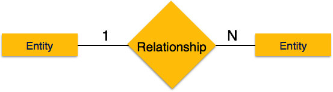

- Many-to-one − When more than one instance of entity is associated with the relationship, it is marked as 'N:1'. The following image reflects that more than one instance of an entity on the left and only one instance of an entity on the right can be associated with the relationship. It depicts many-to-one relationship.


- Many-to-many − The following image reflects that more than one instance of an entity on the left and more than one instance of an entity on the right can be associated with the relationship. It depicts many-to-many relationship.


##### Participation Constraints
- Total Participation − Each entity is involved in the relationship. Total participation is represented by double lines.

- Partial participation − Not all entities are involved in the relationship. Partial participation is represented by single lines.

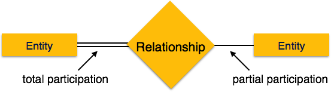

### Generalization and Specialization
The ER Model has the power of expressing database entities in a conceptual hierarchical manner. As the hierarchy goes up, it generalizes the view of entities, and as we go deep in the hierarchy, it gives us the detail of every entity included.

Going up in this structure is called generalization, where entities are clubbed together to represent a more generalized view. For example, a particular student named Mira can be generalized along with all the students. The entity shall be a student, and further, the student is a person. The reverse is called specialization where a person is a student, and that student is Mira.

#### Generalization
As mentioned above, the process of generalizing entities, where the generalized entities contain the properties of all the generalized entities, is called generalization. In generalization, a number of entities are brought together into one generalized entity based on their similar characteristics. For example, pigeon, house sparrow, crow and dove can all be generalized as Birds.


#### Specialization
Specialization is the opposite of generalization. In specialization, a group of entities is divided into sub-groups based on their characteristics. Take a group ‘Person’ for example. A person has name, date of birth, gender, etc. These properties are common in all persons, human beings. But in a company, persons can be identified as employee, employer, customer, or vendor, based on what role they play in the company.


Similarly, in a school database, persons can be specialized as teacher, student, or a staff, based on what role they play in school as entities.

#### Inheritance
We use all the above features of ER-Model in order to create classes of objects in object-oriented programming. The details of entities are generally hidden from the user; this process known as abstraction.

Inheritance is an important feature of Generalization and Specialization. It allows lower-level entities to inherit the attributes of higher-level entities.

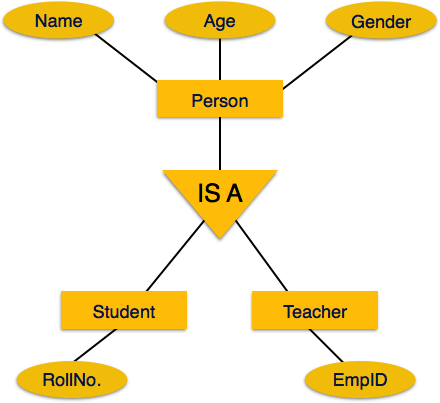

For example, the attributes of a Person class such as name, age, and gender can be inherited by lower-level entities such as Student or Teacher.

### Codd's 12 Rule

Dr Edgar F. Codd, after his extensive research on the Relational Model of database systems, came up with twelve rules of his own, which according to him, a database must obey in order to be regarded as a true relational database.

These rules can be applied on any database system that manages stored data using only its relational capabilities. This is a foundation rule, which acts as a base for all the other rules.

#### Rule 1: Information Rule
The data stored in a database, may it be user data or metadata, must be a value of some table cell. Everything in a database must be stored in a table format.

#### Rule 2: Guaranteed Access Rule
Every single data element (value) is guaranteed to be accessible logically with a combination of table-name, primary-key (row value), and attribute-name (column value). No other means, such as pointers, can be used to access data.

#### Rule 3: Systematic Treatment of NULL Values
The NULL values in a database must be given a systematic and uniform treatment. This is a very important rule because a NULL can be interpreted as one the following − data is missing, data is not known, or data is not applicable.

#### Rule 4: Active Online Catalog
The structure description of the entire database must be stored in an online catalog, known as data dictionary, which can be accessed by authorized users. Users can use the same query language to access the catalog which they use to access the database itself.

#### Rule 5: Comprehensive Data Sub-Language Rule
A database can only be accessed using a language having linear syntax that supports data definition, data manipulation, and transaction management operations. This language can be used directly or by means of some application. If the database allows access to data without any help of this language, then it is considered as a violation.

#### Rule 6: View Updating Rule
All the views of a database, which can theoretically be updated, must also be updatable by the system.

#### Rule 7: High-Level Insert, Update, and Delete Rule
A database must support high-level insertion, updation, and deletion. This must not be limited to a single row, that is, it must also support union, intersection and minus operations to yield sets of data records.

#### Rule 8: Physical Data Independence
The data stored in a database must be independent of the applications that access the database. Any change in the physical structure of a database must not have any impact on how the data is being accessed by external applications.

#### Rule 9: Logical Data Independence
The logical data in a database must be independent of its user’s view (application). Any change in logical data must not affect the applications using it. For example, if two tables are merged or one is split into two different tables, there should be no impact or change on the user application. This is one of the most difficult rule to apply.

#### Rule 10: Integrity Independence
A database must be independent of the application that uses it. All its integrity constraints can be independently modified without the need of any change in the application. This rule makes a database independent of the front-end application and its interface.

#### Rule 11: Distribution Independence
The end-user must not be able to see that the data is distributed over various locations. Users should always get the impression that the data is located at one site only. This rule has been regarded as the foundation of distributed database systems.

#### Rule 12: Non-Subversion Rule
If a system has an interface that provides access to low-level records, then the interface must not be able to subvert the system and bypass security and integrity constraints.


### Relational Data Model
Relational data model is the primary data model, which is used widely around the world for data storage and processing. This model is simple and it has all the properties and capabilities required to process data with storage efficiency.

#### Concepts
- Tables − In relational data model, relations are saved in the format of Tables. This format stores the relation among entities. A table has rows and columns, where rows represents records and columns represent the attributes.

- Tuple − A single row of a table, which contains a single record for that relation is called a tuple.

- Relation instance − A finite set of tuples in the relational database system represents relation instance. Relation instances do not have duplicate tuples.

- Relation schema − A relation schema describes the relation name (table name), attributes, and their names.

- Relation key − Each row has one or more attributes, known as relation key, which can identify the row in the relation (table) uniquely.

- Attribute domain − Every attribute has some pre-defined value scope, known as attribute domain.

#### Constraints
Every relation has some conditions that must hold for it to be a valid relation. These conditions are called Relational Integrity Constraints. There are three main integrity constraints −
```
1. Key constraints

2. Domain constraints

3. Referential integrity constraints
```

##### Key Constraints

There must be at least one minimal subset of attributes in the relation, which can identify a tuple uniquely. This minimal subset of attributes is called key for that relation. If there are more than one such minimal subsets, these are called candidate keys.

Key constraints force that −

- in a relation with a key attribute, no two tuples can have identical values for key attributes.

- a key attribute can not have NULL values.

Key constraints are also referred to as Entity Constraints.

##### Domain Constraints

Attributes have specific values in real-world scenario. For example, age can only be a positive integer. The same constraints have been tried to employ on the attributes of a relation. Every attribute is bound to have a specific range of values. For example, age cannot be less than zero and telephone numbers cannot contain a digit outside 0-9.

##### Referential integrity Constraints

Referential integrity constraints work on the concept of Foreign Keys. A foreign key is a key attribute of a relation that can be referred in other relation.

Referential integrity constraint states that if a relation refers to a key attribute of a different or same relation, then that key element must exist.

### ER Model to Relational Model
ER Model, when conceptualized into diagrams, gives a good overview of entity-relationship, which is easier to understand. ER diagrams can be mapped to relational schema, that is, it is possible to create relational schema using ER diagram. We cannot import all the ER constraints into relational model, but an approximate schema can be generated.

There are several processes and algorithms available to convert ER Diagrams into Relational Schema. Some of them are automated and some of them are manual. We may focus here on the mapping diagram contents to relational basics.

ER diagrams mainly comprise of 
```
1. Entity and its attributes
2. Relationship, which is association among entities.
```

#### Mapping Entity
An entity is a real-world object with some attributes.

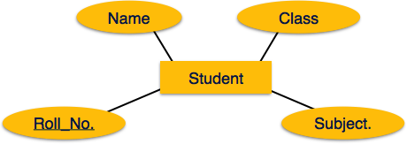

##### Mapping Process (Algorithm)
```
1. Create table for each entity.

2. Entity's attributes should become fields of tables with their respective data types.

3. Declare primary key.
```

#### Mapping Relationship
A relationship is an association among entities.


##### Mapping Process
```
1. Create table for a relationship.

2. Add the primary keys of all participating Entities as fields of table with their respective data types.

3. If relationship has any attribute, add each attribute as field of table.

4. Declare a primary key composing all the primary keys of participating entities.

5. Declare all foreign key constraints.
```

#### Mapping Weak Entity Sets
A weak entity set is one which does not have any primary key associated with it.


##### Mapping Process
```
1. Create table for weak entity set.

2. Add all its attributes to table as field.

3. Add the primary key of identifying entity set.

4. Declare all foreign key constraints.
```

#### Mapping Hierarchical Entities
ER specialization or generalization comes in the form of hierarchical entity sets.

.png)

##### Mapping Process
```
1. Create tables for all higher-level entities.

2. Create tables for lower-level entities.

3. Add primary keys of higher-level entities in the table of lower-level entities.

4. In lower-level tables, add all other attributes of lower-level entities.

5. Declare primary key of higher-level table and the primary key for lower-level table.

6. Declare foreign key constraints.
```

