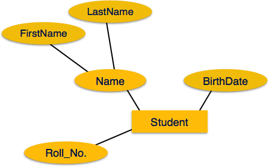
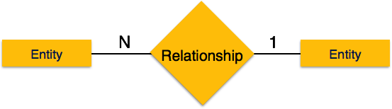

## Home

Database Management System or DBMS refers to the technology of sorting, filtering and retrieving the data with utmost efficiency along with appropriate safety measures. 

### Why Learn DBMS

Traditionally data was organized in file formats. DBMS was a new concept then, and all the research was done to make it overcome the deficiencies of the traditional standard of data management. A modern DBMS has the following characteristics:
    ```
    1. Real World Entity - A modern DBMS is more realistic and uses real-world entities to design it's architecture. 
       It uses the behavior and attributes too. For example, a school database may use students as an entity and 
       their age as an attribute.
    
    2. Relation Based Tables - DBMS allows entities and relations among them to form tables. A user can understand 
       the architecture of a database just by looking at the table name and attributes.
    
    3. Isolation of data and application - A database system is entirely different than its data. A database is an 
       active entity, whereas data is said to be passive, on which the database works and organizes. DBMS also 
       stores metadata, which is data about data, to ease its own process.
    
    4. Less Redundancy - DBMS follows the rules of normalization, which splits a relation when any of its attributes
       is having redundancy in values. Normalization is a mathematically rich and scientific process that reduces 
       data redundancy.
    
    5. Consistency - Consistency is a state where every relation in a database remains consistent. There exist 
       methods and techniques, which can detect attempt of leaving database in inconsistent state. A DBMS can provide 
       greater consistency as compared to earlier forms of data storing applications like file-processing systems.
    
    6. Query Language - DBMS is equipped with query language, which makes it more efficient to retrieve and 
       manipulate data. A user can apply as many and as different filtering options as required to retrieve a set 
       of data. Traditionally it was not possible where file-processing system was used.
    ```

### Applications of DBMS

Database is a collection of related data and data is a collection of facts and figures that can be processed to produce information.

Mostly data represents recordable facts. Data aids in producing information, which is based on facts. For example, if we have data about marks obtained by all students, we can then conclude about toppers and average marks.

A database management system stores data in such a way that it becomes easier to retrieve, manipulate, and produce information. Following are the important characteristics and applications of DBMS.

    
    1. ACID Properties − DBMS follows the concepts of Atomicity, Consistency, Isolation, and Durability (normally 
       shortened as ACID). These concepts are applied on transactions, which manipulate data in a database. ACID 
       properties help the database stay healthy in multi-transactional environments and in case of failure.

    2. Multiuser and Concurrent Access − DBMS supports multi-user environment and allows them to access and 
       manipulate data in parallel. Though there are restrictions on transactions when users attempt to handle 
       the same data item, but users are always unaware of them.

    3. Multiple views − DBMS offers multiple views for different users. A user who is in the Sales department will
       have a different view of database than a person working in the Production department. This feature enables 
       the users to have a concentrate view of the database according to their requirements.

    4. Security − Features like multiple views offer security to some extent where users are unable to access data 
       of other users and departments. DBMS offers methods to impose constraints while entering data into the 
       database and retrieving the same at a later stage. DBMS offers many different levels of security features, 
       which enables multiple users to have different views with different features. For example, a user in the 
       Sales department cannot see the data that belongs to the Purchase department. Additionally, it can also be 
       managed how much data of the Sales department should be displayed to the user. Since a DBMS is not saved on 
       the disk as traditional file systems, it is very hard for miscreants to break the code.
    
## Overview

Database is a collection of related data and data is a collection of facts and figures that can be processed to produce information.

Mostly data represents recordable facts. Data aids in producing information, which is based on facts. For example, if we have data about marks obtained by all students, we can then conclude about toppers and average marks.

A database management system stores data in such a way that it becomes easier to retrieve, manipulate, and produce information.

### Characteristics

Traditionally, data was organized in file formats. DBMS was a new concept then, and all the research was done to make it overcome the deficiencies in traditional style of data management. A modern DBMS has the following characteristics.

    1. Real World Entity - A modern DBMS is more realistic and uses real-world entities to design it's architecture. 
       It uses the behavior and attributes too. For example, a school database may use students as an entity and 
       their age as an attribute.
    
    2. Relation Based Tables - DBMS allows entities and relations among them to form tables. A user can understand 
       the architecture of a database just by looking at the table name and attributes.
    
    3. Isolation of data and application - A database system is entirely different than its data. A database is an 
       active entity, whereas data is said to be passive, on which the database works and organizes. DBMS also 
       stores metadata, which is data about data, to ease its own process.
    
    4. Less Redundancy - DBMS follows the rules of normalization, which splits a relation when any of its attributes
       is having redundancy in values. Normalization is a mathematically rich and scientific process that reduces 
       data redundancy.
    
    5. Consistency - Consistency is a state where every relation in a database remains consistent. There exist 
       methods and techniques, which can detect attempt of leaving database in inconsistent state. A DBMS can provide 
       greater consistency as compared to earlier forms of data storing applications like file-processing systems.
    
    6. Query Language - DBMS is equipped with query language, which makes it more efficient to retrieve and 
       manipulate data. A user can apply as many and as different filtering options as required to retrieve a set 
       of data. Traditionally it was not possible where file-processing system was used.

    7. ACID Properties − DBMS follows the concepts of Atomicity, Consistency, Isolation, and Durability (normally 
       shortened as ACID). These concepts are applied on transactions, which manipulate data in a database. ACID 
       properties help the database stay healthy in multi-transactional environments and in case of failure.

    8. Multiuser and Concurrent Access − DBMS supports multi-user environment and allows them to access and 
       manipulate data in parallel. Though there are restrictions on transactions when users attempt to handle 
       the same data item, but users are always unaware of them.

    9. Multiple views − DBMS offers multiple views for different users. A user who is in the Sales department will
       have a different view of database than a person working in the Production department. This feature enables 
       the users to have a concentrate view of the database according to their requirements.

    10. Security − Features like multiple views offer security to some extent where users are unable to access data 
       of other users and departments. DBMS offers methods to impose constraints while entering data into the 
       database and retrieving the same at a later stage. DBMS offers many different levels of security features, 
       which enables multiple users to have different views with different features. For example, a user in the 
       Sales department cannot see the data that belongs to the Purchase department. Additionally, it can also be 
       managed how much data of the Sales department should be displayed to the user. Since a DBMS is not saved on 
       the disk as traditional file systems, it is very hard for miscreants to break the code.

### Users

A regular DBMS has users with varying rights and permissions for different purposes. Some users retrieve data, while others perform data backups. The users of a DBMS can generally be classified as follows:
   ```
   1. Administrators - Administrators maintain the DBMS and have the responsibility of managing the database. They 
      oversee its usage and determine who can access it. They create user profiles and enforce restrictions to ensure 
      security and isolation. Administrators also handle DBMS resources like system licenses, necessary tools, and 
      maintenance of software and hardware.

   2. Designers are the individuals who focus on the design aspects of the database. They carefully consider what 
      data needs to be stored and in what format. They identify and design the complete set of entities, relationships, 
      constraints, and views.

   3. End users are the ones who directly benefit from having a DBMS. They can range from casual observers who review 
      logs or market rates to sophisticated users like business analysts.
   ```

## Architecture

The way a DBMS is designed depends on its architecture. It can be centralized, decentralized, or hierarchical. The architecture of a DBMS can be classified as either single-tier or multi-tier. In a multi-tier architecture, the entire system is divided into n modules that are related but independent. These modules can be modified, altered, changed, or replaced independently.

### 1-tier architecture
In 1-Tier Architecture the database is directly available to the user, the user can directly sit on the DBMS and use it that is, the client, server, and Database are all present on the same machine. For Example: to learn SQL we set up an SQL server and the database on the local system. This enables us to directly interact with the relational database and execute operations. The industry won’t use this architecture they logically go for 2-Tier and 3-Tier Architecture.

#### Advantages of 1-tier architecture
- Simple Architecture: 1-Tier Architecture is the most simple architecture to set up, as only a single machine is required to maintain it.
- Cost-Effective: No additional hardware is required for implementing 1-Tier Architecture, which makes it cost-effective.
- Easy to Implement: 1-Tier Architecture can be easily deployed, and hence it is mostly used in small projects. 


### 2-tier architecture
The 2-tier architecture is similar to a basic client-server model. The application at the client end directly communicates with the database on the server side. APIs like ODBC and JDBC are used for this interaction. The server side is responsible for providing query processing and transaction management functionalities. On the client side, the user interfaces and application programs are run. The application on the client side establishes a connection with the server side in order to communicate with the DBMS. 
An advantage of this type is that maintenance and understanding are easier, and compatible with existing systems. However, this model gives poor performance when there are a large number of users. 

#### Advantages of 2-tier architecture
- Easy to Access: 2-Tier Architecture makes easy access to the database, which makes fast retrieval.
- Scalable: We can scale the database easily, by adding clients or by upgrading hardware.
- Low Cost: 2-Tier Architecture is cheaper than 3-Tier Architecture and Multi-Tier Architecture.
- Easy Deployment: 2-Tier Architecture is easy to deploy than 3-Tier Architecture.
- Simple: 2-Tier Architecture is easily understandable as well as simple because of only two components.


### 3-tier architecture
In 3-Tier Architecture, there is another layer between the client and the server. The client does not directly communicate with the server. Instead, it interacts with an application server which further communicates with the database system and then the query processing and transaction management takes place. This intermediate layer acts as a medium for the exchange of partially processed data between the server and the client. This type of architecture is used in the case of large web applications. 

#### Advantages of 3-tier architecture
- Enhanced scalability: Scalability is enhanced due to distributed deployment of application servers. Now, individual connections need not be made between the client and server.
- Data Integrity: 3-Tier Architecture maintains Data Integrity. Since there is a middle layer between the client and the server, data corruption can be avoided/removed.
- Security: 3-Tier Architecture Improves Security. This type of model prevents direct interaction of the client with the server thereby reducing access to unauthorized data.

#### Disadvantages of 3-tier Architecture

- More Complex: 3-Tier Architecture is more complex in comparison to 2-Tier Architecture. Communication Points are also doubled in 3-Tier Architecture.
- Difficult to Interact: It becomes difficult for this sort of interaction to take place due to the presence of middle layers.


### Data Models
Data models define how the logical structure of a database is modeled. Data Models are fundamental entities to introduce abstraction in a DBMS. Data models define how data is connected to each other and how they are processed and stored inside the system.

The very first data model could be flat data-models, where all the data used are to be kept in the same plane. Earlier data models were not so scientific, hence they were prone to introduce lots of duplication and update anomalies.

#### Entity Relationship Model
Entity-Relationship (ER) Model is based on the notion of real-world entities and relationships among them. While formulating real-world scenario into the database model, the ER Model creates entity set, relationship set, general attributes and constraints.

ER Model is best used for the conceptual design of a database.

ER Model is based on:

- Entity − An entity in an ER Model is a real-world entity having properties called attributes. Every attribute is defined by its set of values called domain. For example, in a school database, a student is considered as an entity. Student has various attributes like name, age, class, etc.

- Relationship − The logical association among entities is called relationship. Relationships are mapped with entities in various ways. Mapping cardinalities define the number of association between two entities.

Mapping cardinalities:

   - one to one
   - one to many
   - many to one
   - many to many


#### Relational Model
The most popular data model in DBMS is the Relational Model. It is more scientific a model than others. This model is based on first-order predicate logic and defines a table as an n-ary relation. The main highlights of this model are:
- Data is stored in tables called relations.
- Relations can be normalized.
- In normalized relations, values saved are atomic values.
- Each row in a relation contains a unique value.
- Each column in a relation contains values from a same domain.


### Data Schemas
A database schema is the skeleton structure that represents the logical view of the entire database. It defines how the data is organized and how the relations among them are associated. It formulates all the constraints that are to be applied on the data.

A database schema defines its entities and the relationship among them. It contains a descriptive detail of the database, which can be depicted by means of schema diagrams. It’s the database designers who design the schema to help programmers understand the database and make it useful.


A database schema can be divided broadly into two categories:
- Physical Database Schema − This schema pertains to the actual storage of data and its form of storage like files, indices, etc. It defines how the data will be stored in a secondary storage.
- Logical Database Schema − This schema defines all the logical constraints that need to be applied on the data stored. It defines tables, views, and integrity constraints.

#### Database Instance
It is important that we distinguish these two terms individually. Database schema is the skeleton of database. It is designed when the database doesn't exist at all. Once the database is operational, it is very difficult to make any changes to it. A database schema does not contain any data or information.

A database instance is a state of operational database with data at any given time. It contains a snapshot of the database. Database instances tend to change with time. A DBMS ensures that its every instance (state) is in a valid state, by diligently following all the validations, constraints, and conditions that the database designers have imposed.

### Data Independence

A database system normally contains a lot of data in addition to users’ data. For example, it stores data about data, known as metadata, to locate and retrieve data easily. It is rather difficult to modify or update a set of metadata once it is stored in the database. But as a DBMS expands, it needs to change over time to satisfy the requirements of the users. If the entire data is dependent, it would become a tedious and highly complex job.

Metadata itself follows a layered architecture, so that when we change data at one layer, it does not affect the data at another level. This data is independent but mapped to each other.


#### Logical Data Independence
Logical data is data about database, that is, it stores information about how data is managed inside. For example, a table (relation) stored in the database and all its constraints, applied on that relation.

Logical data independence is a kind of mechanism, which liberalizes itself from actual data stored on the disk. If we do some changes on table format, it should not change the data residing on the disk.

#### Physical Data Independence
All the schemas are logical, and the actual data is stored in bit format on the disk. Physical data independence is the power to change the physical data without impacting the schema or logical data.

For example, in case we want to change or upgrade the storage system itself − suppose we want to replace hard-disks with SSD − it should not have any impact on the logical data or schemas.

### Entity Relationship Model
The ER model defines the conceptual view of a database. It works around real-world entities and the associations among them. At view level, the ER model is considered a good option for designing databases.

#### Entity
An entity can be a real-world object, either animate or inanimate, that can be easily identifiable. For example, in a school database, students, teachers, classes, and courses offered can be considered as entities. All these entities have some attributes or properties that give them their identity.

An entity set is a collection of similar types of entities. An entity set may contain entities with attribute sharing similar values. For example, a Students set may contain all the students of a school; likewise a Teachers set may contain all the teachers of a school from all faculties. Entity sets need not be disjoint.

#### Attributes
Entities are represented by means of their properties, called attributes. All attributes have values. For example, a student entity may have name, class, and age as attributes.

There exists a domain or range of values that can be assigned to attributes. For example, a student's name cannot be a numeric value. It has to be alphabetic. A student's age cannot be negative, etc.

##### Types of Attributes
- Simple attribute − Simple attributes are atomic values, which cannot be divided further. For example, a student's phone number is an atomic value of 10 digits.

- Composite attribute − Composite attributes are made of more than one simple attribute. For example, a student's complete name may have first_name and last_name.

- Derived attribute − Derived attributes are the attributes that do not exist in the physical database, but their values are derived from other attributes present in the database. For example, average_salary in a department should not be saved directly in the database, instead it can be derived. For another example, age can be derived from data_of_birth.

- Single-value attribute − Single-value attributes contain single value. For example − Social_Security_Number.

- Multi-value attribute − Multi-value attributes may contain more than one values. For example, a person can have more than one phone number, email_address, etc.

##### Entity-Set and Keys
Key is an attribute or collection of attributes that uniquely identifies an entity among entity set.

For example, the roll_number of a student makes him/her identifiable among students.

- Super Key − A set of attributes (one or more) that collectively identifies an entity in an entity set.

- Candidate Key − A minimal super key is called a candidate key. An entity set may have more than one candidate key.

- Primary Key − A primary key is one of the candidate keys chosen by the database designer to uniquely identify the entity set.

### Relationship
The association among entities is called a relationship. For example, an employee works_at a department, a student enrolls in a course. Here, Works_at and Enrolls are called relationships.

#### Relationship Set
A set of relationships of similar type is called a relationship set. Like entities, a relationship too can have attributes. These attributes are called descriptive attributes.

#### Degree of Relationship
The number of participating entities in a relationship defines the degree of the relationship.

- Binary = degree 2
- Ternary = degree 3
- n-ary = degree

#### Mapping Cardinalities
Cardinality defines the number of entities in one entity set, which can be associated with the number of entities of other set via relationship set.

One-to-one − One entity from entity set A can be associated with at most one entity of entity set B and vice versa.


One-to-many − One entity from entity set A can be associated with more than one entities of entity set B however an entity from entity set B, can be associated with at most one entity.


Many-to-one − More than one entities from entity set A can be associated with at most one entity of entity set B, however an entity from entity set B can be associated with more than one entity from entity set A.


Many-to-many − One entity from A can be associated with more than one entity from B and vice versa.


### ER Diagram Representation
Let us now learn how the ER Model is represented by means of an ER diagram. Any object, for example, entities, attributes of an entity, relationship sets, and attributes of relationship sets, can be represented with the help of an ER diagram.

#### Entity
Entities are represented by means of rectangles. Rectangles are named with the entity set they represent.


#### Attributes
Attributes are the properties of entities. Attributes are represented by means of ellipses. Every ellipse represents one attribute and is directly connected to its entity (rectangle).


If the attributes are composite, they are further divided in a tree like structure. Every node is then connected to its attribute. That is, composite attributes are represented by ellipses that are connected with an ellipse.



Multivalued attributes are depicted by double ellipse.


Derived attributes are depicted by dashed ellipse.


#### Relationship
Relationships are represented by diamond-shaped box. Name of the relationship is written inside the diamond-box. All the entities (rectangles) participating in a relationship, are connected to it by a line.

##### Binary Relationship and Cardinality
A relationship where two entities are participating is called a binary relationship. Cardinality is the number of instance of an entity from a relation that can be associated with the relation.

- One-to-one − When only one instance of an entity is associated with the relationship, it is marked as '1:1'. The following image reflects that only one instance of each entity should be associated with the relationship. It depicts one-to-one relationship.


- One-to-many − When more than one instance of an entity is associated with a relationship, it is marked as '1:N'. The following image reflects that only one instance of entity on the left and more than one instance of an entity on the right can be associated with the relationship. It depicts one-to-many relationship.


- Many-to-one − When more than one instance of entity is associated with the relationship, it is marked as 'N:1'. The following image reflects that more than one instance of an entity on the left and only one instance of an entity on the right can be associated with the relationship. It depicts many-to-one relationship.



- Many-to-many − The following image reflects that more than one instance of an entity on the left and more than one instance of an entity on the right can be associated with the relationship. It depicts many-to-many relationship.


##### Participation Constraints
- Total Participation − Each entity is involved in the relationship. Total participation is represented by double lines.

- Partial participation − Not all entities are involved in the relationship. Partial participation is represented by single lines.

